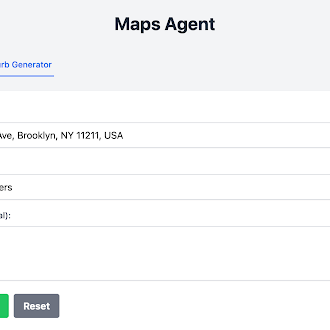
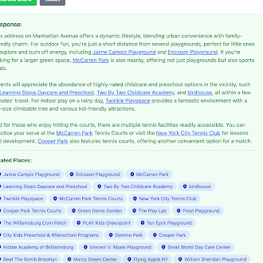
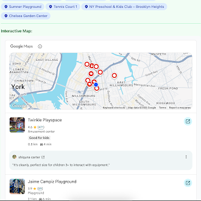
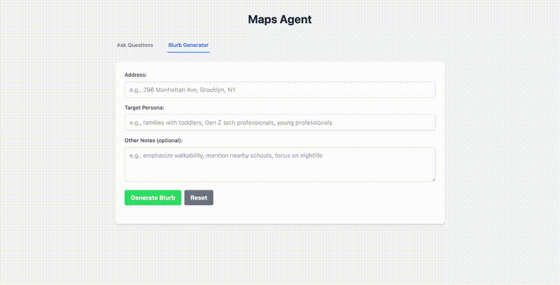

# ADK with Google Maps Integration

This project demonstrates how to integrate Google Maps grounding capabilities with ADK (Agent Development Kit) agents. It includes multiple approaches for using Maps grounding in conversational AI applications and a complete web interface for interacting with the maps agent.

<div align="center">
  
  
  
</div>

## Demo



*Interactive demonstration of the web interface showing both Ask Questions and Blurb Generator tabs*

## Overview

This directory contains examples of how to use Google's Maps grounding feature with ADK agents:

1. **Maps Agent** - A structured ADK agent package with Maps grounding integration
2. **Web UI** - A FastAPI web interface with interactive maps and address autocomplete
3. **LLM Agent with Maps Tool** - A generic ADK agent that calls Maps grounding via a Python tool function
4. **UI Widget Demo** - A frontend demonstration of the Maps grounding widget

## Project Structure

```
adk_with_maps/
├── maps_agent/                    # Structured ADK agent package
│   ├── __init__.py
│   ├── __main__.py               # CLI runner
│   ├── agent.py                  # Core agent implementation
│   └── run_agent.py              # Typed coroutine for running agent
├── app/                          # FastAPI web interface
│   ├── ui.py                     # Main FastAPI application
│   └── templates/
│       └── index.html            # Web UI with tabs and maps integration
├── llm_agent_with_maps_tool/     # Generic agent with Maps tool
│   └── agent.py
├── ui_maps_grounding_widget/     # Frontend widget demo
│   ├── index.html
│   ├── widget_context_token.json
│   ├── image.png
│   └── README.md
├── util_generate_with_maps.py    # Utility for Maps grounding API calls
├── requirements.txt              # Python dependencies (includes FastAPI)
└── README.md                     # This file
```

## Prerequisites

- Python 3.8+
- Google Cloud Project with Maps and Vertex AI APIs enabled
- Google Maps JavaScript API key (for UI demo)
- Vertex AI authentication configured

## Setup

### 1. Python Environment

Set up the Python environment using `uv`:

```bash
# Install dependencies
uv pip install -r requirements.txt

# Or if you prefer to use a virtual environment
uv venv
source .venv/bin/activate  # On Windows: .venv\Scripts\activate
uv pip install -r requirements.txt
```

### 2. Google Cloud Authentication

Ensure you have Vertex AI authentication configured:

```bash
# Set up application default credentials
gcloud auth application-default login

# Or set the service account key file
export GOOGLE_APPLICATION_CREDENTIALS="path/to/your/service-account-key.json"
```

## Usage

### 1. Web Interface (Recommended)

The project includes a complete FastAPI web interface with interactive maps:

```bash
# Start the web UI
cd app
uv run python ui.py

# Or run from the project root
uv run python -m app.ui
```

Navigate to `http://localhost:8000` to access the web interface, which includes:

- **Ask Questions Tab**: General location-based queries with inline place links and interactive maps
- **Blurb Generator Tab**: Targeted content generation with address autocomplete and persona-based prompts

### 2. Command Line Interface

Run the maps agent directly from the command line:

```bash
# Using the package
uv run python -m maps_agent "Write a blurb about the neighborhood of 296 Manhattan Ave, brooklyn"

# Using the agent module directly
uv run python -m maps_agent.agent "What's great about living in Greenpoint, Brooklyn?"

# Save output to JSON
uv run python -m maps_agent "Describe the area around Central Park" --output results.json
```

### 3. ADK Server Integration

Start the ADK web server to access agents in the ADK framework:

```bash
adk web
```

## Components

### 1. Maps Agent (`maps_agent/`)

A structured ADK agent package that integrates Google Maps grounding. Features:

- **Typed coroutine interface** (`run_agent.py`) for programmatic access
- **CLI runner** with JSON output support
- **Direct Maps grounding integration** using Vertex AI's Gemini model
- **Structured response handling** with grounding metadata extraction

**Use case**: Core maps functionality that can be used via CLI, web UI, or integrated into other applications.

### 2. Web UI (`app/`)

A FastAPI web application providing an interactive interface:

- **Dual-tab interface**: Ask Questions and Blurb Generator
- **Google Maps integration**: Interactive maps widget showing grounded locations
- **Address autocomplete**: Real-time address suggestions using Google Places API
- **Inline place linking**: Automatic links to Google Maps for mentioned places
- **Persona-targeted content**: Generate location blurbs targeted to specific audiences

**Use case**: User-friendly web interface for interactive location queries and content generation.

### 3. LLM Agent with Maps Tool (`llm_agent_with_maps_tool/`)

A generic ADK agent that uses Maps grounding as a callable tool:

- Uses standard LLM agent framework
- Calls Maps grounding via Python function when needed
- Provides explicit control over Maps API usage

**Use case**: Integration with existing ADK agent workflows and tool-based architectures.

## Usage Examples

### Web Interface Examples

1. **Ask Questions Tab**:
   - "What amenities are within walking distance of 123 Main Street?"
   - "Show me grocery stores and shopping centers near downtown San Francisco"
   - "What's the commute like from Brooklyn to Manhattan?"

2. **Blurb Generator Tab**:
   - Address: "296 Manhattan Ave, Brooklyn, NY"
   - Persona: "young professionals"
   - Other Notes: "emphasize nightlife and public transit"

### Command Line Examples

```bash
# General neighborhood description
uv run python -m maps_agent "Describe the Williamsburg neighborhood in Brooklyn"

# Targeted content generation
uv run python -m maps_agent "Generate a blurb about 123 Main St, Boston that would appeal to families with children. Write it in a natural, engaging way without being overly obvious about the target audience"

# Save detailed output
uv run python -m maps_agent "What's around Central Park?" -o central_park_analysis.json
```

## Key Features

- **Contextual Map Integration**: Both agents provide location-aware responses
- **Rich Visualizations**: Responses include tokens for map widgets when appropriate
- **Flexible Architecture**: Choose between native integration or tool-based approaches
- **Real-time Data**: Leverages Google's real-time Maps and Places data

## Configuration

### API Requirements

Ensure these APIs are enabled in your Google Cloud Project:

- Vertex AI API
- Maps JavaScript API (for UI components)
- Places API (for location data)

## Troubleshooting

**Authentication Issues**: 
- Verify `gcloud auth application-default login` is configured
- Check that your service account has Vertex AI permissions

**Maps API Errors**:
- Ensure Maps JavaScript API is enabled
- Verify billing is set up (Google provides $200/month free credits)

**ADK Server Issues**:
- Make sure all dependencies are installed: `uv pip install -r requirements.txt`
- Check that the ADK server is running: `adk web`
