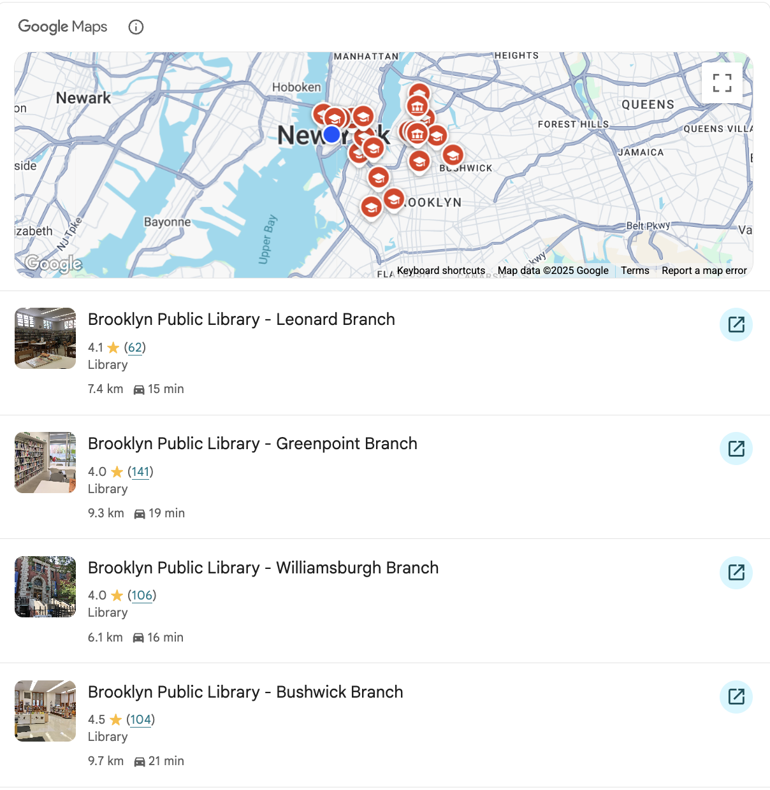

# Google Maps Grounding Widget Demo



## What is this?

This is a simple demonstration of Google's **Maps Grounding Widget**, an experimental feature that integrates map-based context into conversational AI experiences. The widget displays user-generated content and map visualizations based on context tokens generated by the Vertex AI API.

## Features

- **Contextual Map Integration**: Displays relevant map information based on AI-generated context
- **Multiple Display Modes**: Supports 2D roadmap, 3D hybrid, or no map display
- **Flexible Layout Options**: Compact or vertical list layouts
- **Real-time Rendering**: Dynamically loads and renders map content

## Files

- `index.html` - Main demo page with Google Maps integration
- `widget_context_token.json` - Context token generated from Vertex AI API
- `image.png` - Screenshot of the working demo
- `README.md` - This documentation

## Prerequisites

1. **Google Maps API Key**: You'll need a Google Maps JavaScript API key
   - Go to [Google Cloud Console](https://console.cloud.google.com/)
   - Enable the "Maps JavaScript API"
   - Create an API key with JavaScript API permissions
   - (Optional) Restrict to `localhost:*` for security

2. **Context Token**: The `widget_context_token.json` file contains a pre-generated token from Vertex AI

## Setup Instructions

1. **Configure API Key**:
   ```bash
   # Edit index.html and replace YOUR_ACTUAL_API_KEY_HERE with your API key
   sed -i 's/YOUR_ACTUAL_API_KEY_HERE/your_actual_key_here/g' index.html
   ```

2. **Start Local Server**:
   ```bash
   # Using Python
   python -m http.server 8000
   
   # Or using Node.js
   npx http-server -p 8000
   
   # Or using any other local server
   ```

3. **Open in Browser**:
   ```
   http://localhost:8000
   ```

## How It Works

1. **Token Loading**: The app loads the context token from `widget_context_token.json`
2. **Token Cleaning**: Removes control characters and whitespace from the token string
3. **Widget Creation**: Instantiates a `PlaceContextualElement` with the cleaned token
4. **Rendering**: Appends the widget to the DOM container

## Key Implementation Details

- Uses Google Maps JavaScript API **alpha version** (required for experimental features)
- Loads the `places` library for the grounding widget functionality
- Handles JSON parsing errors due to control characters in the token
- Provides error handling and user feedback

## Troubleshooting

**"API key not found"**: Replace `YOUR_ACTUAL_API_KEY_HERE` with your actual API key

**"PlaceContextualElement is not a constructor"**: Ensure you're using the alpha version of the Maps API

**JSON parsing errors**: The code automatically cleans control characters from the token

**CORS errors**: Must serve via HTTP server, not file:// protocol

## Important Notes

⚠️ **Experimental Feature**: The Maps Grounding Widget is a pre-GA product with limited support and potential compatibility changes.

⚠️ **Billing Required**: Google Maps API requires billing to be enabled, but provides $200/month in free credits.

## Next Steps

- Experiment with different `listLayout` and `mapMode` options
- Generate new context tokens using the Vertex AI API
- Integrate into larger conversational AI applications